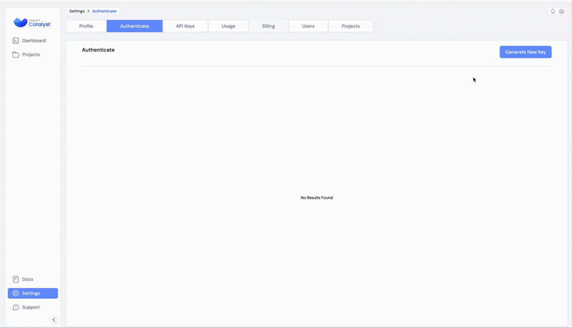

## FAQ for RagaAI Catalyst

This FAQ covers common questions to help you get started and make the most of the platform.

**1. How do I install RagaAI Catalyst on my system?**

To install RagaAI Catalyst, open your terminal and run the following command:

```bash
pip install ragaai-catalyst
```

**2. How do I generate authentication credentials?**

To generate authentication credentials, follow these steps:

1. Log in to your RagaAI Catalyst account.
2. Navigate to your profile settings.
3. Select the "Authenticate" option.
4. Click "Generate New Key" to create your access and secret keys.



Once you have your keys, use them in your code as shown below:

```python
from ragaai_catalyst import RagaAICatalyst

catalyst = RagaAICatalyst(
    access_key="your_access_key",
    secret_key="your_secret_key",
    base_url="your_base_url"
)
```

**3. How can I list all existing projects and create a new project?**

To manage projects, use the following code:

```python
# List projects
projects = catalyst.list_projects()
print(projects)

# Create a new project
project = catalyst.create_project(
    project_name="QA_project",
    usecase="Chatbot"
)

# You can also retrieve available use cases for projects:
usecases = catalyst.project_use_cases()
print(usecases)
```
Make sure to replace `QA_project` and `Chatbot` with your desired project name and use case.

**4. How can I upload a dataset in CSV or JSONL format to a specific project?**

You can upload datasets by following these instructions:

```python
from ragaai_catalyst import Dataset

dataset_manager = Dataset(project_name="my_project")

# For CSV format:
dataset_manager.create_from_csv(
    csv_path="path/to/your.csv",
    dataset_name="production_logs",
    schema_mapping={
        'user_query': 'prompt',
        'bot_response': 'response'
    }
)

# For JSONL format:
dataset_manager.create_from_jsonl(
    jsonl_path="path/to/your.jsonl",
    dataset_name="user_feedback",
    schema_mapping={
        'user_id': 'user_id',
        'feedback': 'feedback'
    }
)
```
Replace `path/to/file`  with the actual path to your `CSV/JSONL` file.
The `schema_mapping` parameter ensures that your data correctly maps to the required schema format.

**5. How do I create a new dataset using a dataframe?**

If you have a pandas dataframe, you can create a dataset directly using the following code:

```python
dataset_manager.create_from_df(
    df=df,
    dataset_name='MyDataset',
    schema_mapping={'column1': 'schema_element1', 'column2': 'schema_element2'}
)
```
Replace `df` with your dataframe variable, and update `schema_mapping` to match your column names.

**6. How do I add evaluation metrics like "Faithfulness" or "Hallucination"?**

To add evaluation metrics, follow these steps:

```python
from ragaai_catalyst import Evaluation

# Create an evaluation experiment:
evaluation = Evaluation(
    project_name="QA_project",
    dataset_name="MyDataset",
)

# Get list of available metrics
available_metrics = evaluation.list_metrics()
print(available_metrics)

schema_mapping={
    'Query': 'prompt',
    'response': 'response',
    'Context': 'context',
    'expectedResponse': 'expected_response'
}

evaluation.add_metrics(
    metrics=[
        {"name": "Faithfulness", "config": {"model": "gpt-4o-mini", "provider": "openai", "threshold": {"gte": 0.323}}, "column_name": "Faithfulness_gte", "schema_mapping": schema_mapping},
        {"name": "Hallucination", "config": {"model": "gpt-4o-mini", "provider": "openai", "threshold": {"eq": 0.323}}, "column_name": "Hallucination_eq", "schema_mapping": schema_mapping},
    ]
)
```

**7. How can I retrieve the status and results of an evaluation experiment?**

Retrieve experiment results using this code:

```python
from ragaai_catalyst import Evaluation

eval = Evaluation(project_name="QA_project", dataset_name="MyDataset")
results = eval.get_results()
print(results)
```


**8. How can I list available prompts in my project and retrieve a specific version of a prompt?**

To manage prompts, use the following commands:

```python
from ragaai_catalyst import PromptManager

pm = PromptManager(project_name="chatbot_project")
prompts = pm.list_prompts()
print("Available prompts:", prompts)

vulnerability_check = pm.get_prompt("safety_check", version="v2")
print(f"Safety Check V2: {vulnerability_check.get_variables()}")
```
Replace `safety_check` and `v2` with the desired prompt name and version.


**9. How can I list fail conditions for guardrails and retrieve details about specific deployments?**

Follow these steps:

```python
# Get list of Guardrails available
guardrails_list = gdm.list_guardrails()
print('guardrails_list:', guardrails_list)

# Get list of fail condition for guardrails
fail_conditions = gdm.list_fail_condition()
print('fail_conditions:', fail_conditions)

# Get specific deployment id with guardrails information
deployment_id_detail = gdm.get_deployment(17)
print('deployment_id_detail:', deployment_id_detail)
```

**10. How do I add guardrails to a deployment ID?**

To add guardrails, use this code snippet:

```python
from ragaai_catalyst import GuardrailsManager, GuardExecutor, RagaAICatalyst

catalyst = RagaAICatalyst(
    access_key="your_access_key",
    secret_key="your_secret_key"
)

gdm = GuardrailsManager(project_name="FinanceBot")
print('Deployments in project:\n', gdm.list_deployment_ids())

guardrails = [{
      "displayName": "toxicity_res",
      "name": "Toxicity",
      "config":{
          "mappings": [{
                        "schemaName": "Text",
                        "variableName": "Response"
                    }],
          "params": {
                    "isActive": {"value": False},
                    "isHighRisk": {"value": True},
                    "threshold": {"eq": 0},
                }
      }
    },
    {
      "displayName": "unusual_prompt_res",
      "name": "Unusual Prompt",
      "config":{
          "mappings": [{
                        "schemaName": "Prompt",
                        "variableName": "Prompt"
                    }],
          "params":{
              "isActive": {"value": False},
              "isHighRisk": {"value": True},
              "threshold": {"lt1": 1}
          }
      }
    }]
gdm.add_guardrails(deployment_id, guardrails, guardrails_config)
```

**11. Where can I find more documentation and resources for RagaAI Catalyst?**

For more detailed documentation, tutorials, and examples, visit our official documentation at [https://docs.raga.ai](https://docs.raga.ai/ragaai-catalyst). 
